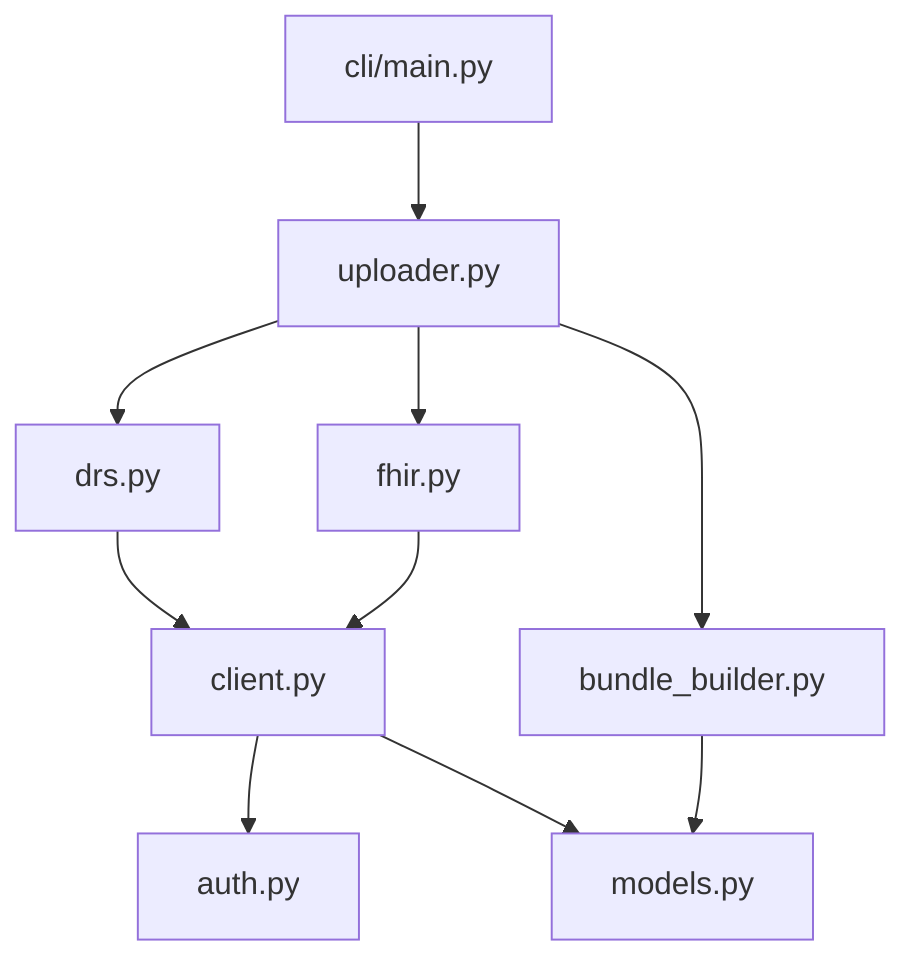

You are creating a complete design and build specification for a software project.

The user has asked:

`$ARGUMENTS`

---

## What you are producing

A `specification/` directory containing five documents that together form a **self-contained build spec** — a fresh agent session or a human developer should be able to open this directory, read the files in order, and build the working, tested project without needing the original conversation.

| File | Purpose |
|---|---|
| `README.md` | Orientation — what it does, project layout, quick start, target user, non-goals |
| `DESIGN.md` | Technical deep-dive — architecture, module responsibilities, data models, error strategy, testing strategy, compliance if applicable |
| `IMPLEMENTATION.md` | Ordered, test-first (TDD) build plan — milestone table, code sketches for every module, verification commands |
| `REFERENCE.md` | External reference — endpoint catalogues, auth flows, env vars, external dependencies, glossary |
| `build-prompt.md` | Agent build instructions — the prompt to give a fresh agent session to build the project from this spec |

---

## Step 1 — Gather context

Check whether a project description, codebase, or existing notes are available in the current working directory:

```bash
ls -la && find . -name "*.md" -not -path "*/specification/*" | head -20 2>/dev/null || true
```

If there is existing code, read key files (entry point, main module, any existing README) to understand the project.

Then determine if you have enough information to write the specification. You need to know:

1. **What does it do?** One sentence describing the primary function.
2. **Who uses it?** Job role, technical level, deployment context.
3. **What is the technology stack?** Language, key libraries, external APIs or services it integrates with.
4. **What is the project scope?** What problem does it solve, what are the boundaries?
5. **Any compliance/regulatory obligations?** (NHS clinical safety, data protection, security controls, etc.)

Ask only the questions you cannot answer from what is already available. Ask at most four questions total; combine them if possible.

---

## Step 2 — Plan the specification structure

Before writing, think through and outline:

- **Module/component breakdown** — what are the main source files and their responsibilities?
- **External integrations** — what APIs, services, or data stores does it touch?
- **Data model** — what are the key data structures passed between components?
- **Error conditions** — what can go wrong at each stage?
- **Test strategy** — what needs mocking, what are the key acceptance criteria?
- **Build milestones** — in what order should the components be built TDD-style? Aim for 6–12 milestones where each ends in a passing test suite.

---

## Step 3 — Write the five documents

Write them in this order: README → DESIGN → IMPLEMENTATION → REFERENCE → build-prompt.

Create the `specification/` directory in the working directory, then write each file.

---

### README.md conventions

Follow this structure exactly:

```
# <project-name> — <one-line tagline>

<2–4 sentence description of what the project is and why it exists.>

## What this <tool/library/service> does

<Active voice. Describe from the perspective of an operator who has just invoked it.
Use a numbered list for the key operational steps / stages it performs.>

## Status of this document set

These documents are the **complete design and build specification**. A fresh
agent session (or a human developer) should be able to open this directory, read
the files in order, and build a working, tested <project> without needing the
original conversation.

Read in this order:

1. **README.md** (this file) — orientation and quick start
2. **DESIGN.md** — <brief description of what DESIGN covers for this project>
3. **IMPLEMENTATION.md** — milestone-by-milestone TDD build plan with code sketches
4. **REFERENCE.md** — <brief description of what REFERENCE covers for this project>

## Project layout (target)

<Complete annotated file tree using ``` code block. Every file gets a trailing
comment explaining its role. Group by: source package, CLI, tests, specification.>

## Quick start (once built)

<Numbered steps: clone/init, create venv / install deps, configure credentials/env,
run tests, invoke the main command with a realistic example.>

## Target user

<1–3 sentences describing the primary user: their job role, technical level,
context of use, and what they get from this tool that they couldn't do as easily
without it.>

## Non-goals

<Bullet list of things this project deliberately does NOT do. Be specific.
Each bullet saves a future contributor from adding the wrong feature.>
```

---

### DESIGN.md conventions

Structure:

1. **Problem statement / context** — why this tool exists; what external system, API, or protocol it wraps.
2. **External system or protocol overview** — if the project integrates with an external API or protocol, describe it: environments, auth, rate limits, key operations. Include a table of endpoints/operations if applicable.
3. **Architecture diagram** — Mermaid diagram showing how the main components relate. Use `flowchart TD` for top-down architecture, `flowchart LR` for pipelines. Label edges to show what data or calls flow between components.
4. **Module responsibilities** — one subsection per source file (e.g. `### 3.1 auth.py`). For each: bullet-list responsibilities, key public interface (function signatures), what it must NOT do (especially around security/logging).
5. **Data model** — key dataclasses or interfaces. Show Python `@dataclass` or TypeScript `interface` definitions with comments.
6. **Error handling strategy** — table mapping exception class → HTTP status or cause. State which module raises each.
7. **Testing strategy** — Red/Green TDD explanation. Table: module → what to mock. List acceptance criteria for v0.1 as a checkbox list.
8. **Limitations** — numbered list of known gaps, trade-offs, or deferred functionality. Be honest and specific.
9. **Compliance / security alignment** (if applicable) — give each applicable standard or framework its own numbered subsection (e.g. `### 9.1 NHS DSPT/CAF`, `### 9.2 DCB0129 — manufacture`, `### 9.3 DCB0160 — deployment`). Each subsection must include: applicability determination, the specific controls in this spec that satisfy it, and any obligations that rest with the operator rather than the software. Do not merge multiple standards into one paragraph. Only include if the project has real compliance obligations.
10. **Use cases** — a short numbered list: primary user scenario first, secondary users, and any explicit non-use-cases that would be easy to mistake for valid use.
11. **Open design questions** (if applicable) — deferred decisions listed as numbered questions, each stating what was decided for v0.1 if applicable.
12. **Appendix / worked example** (if applicable) — if the project processes a specific data format (VCF, CSV, log output, FHIR Bundle), include a before/after example anchoring what correct behaviour looks like. Commit this as a golden test fixture.

**Mermaid diagram conventions:**

Use `flowchart TD` for architecture (top-down data flow) and `flowchart LR` for left-to-right pipeline diagrams. Label edges with the data or call being passed.

````markdown

````

**Module responsibility rules:**
- State what the module IS responsible for (active voice).
- State what it must NOT do — especially: must not log sensitive values, must not do I/O it doesn't own, must not make network calls it doesn't own.
- Show the public interface as actual function signatures, not prose.
- For any module that implements a multi-step algorithm or a state machine (a toggle setter with confirmation logic, an auth token cache, an upload orchestrator, a pipeline dispatcher), number the steps in order and name each one. A bulleted prose summary is not enough — the implementing agent must be able to follow steps 1→N without ambiguity.

---

### IMPLEMENTATION.md conventions

Structure:

```
## 0. Prerequisites
<What must be installed before starting. Links to setup commands.>

## 1. Project scaffold
<The complete target file tree as a code block. Then: the full content of
pyproject.toml / package.json with all dependencies. Any .env.example.>

## 2. Milestone plan

| M | Module(s) | Red tests written | Green when |
|---|---|---|---|
| M1 | exceptions / scaffold | — | import succeeds |
| M2 | core_module | test_core.py | all tests green |
...

## 3. Milestone 1 — <name> (TDD)

### Red: write tests first
<Actual test code as a code block. Tests must be runnable.
Show the expected failure.>

### Green: implement <module>
<Implementation code as a code block. Minimal to pass the tests.
Call out any non-obvious implementation choices with comments.>

**Verification:** `<exact command>` — all tests green.

## 4. Milestone 2 — ...
<Repeat pattern for every milestone.>

## N. Final checks
<Full command list: coverage, lint, SAST, security checks, anything else
required before declaring the project done.>
```

**Milestone conventions:**
- Every milestone ends with an exact verification command the agent can run.
- Keep milestones small — one module or one cohesive set of functionality per milestone.
- Test sketches must be real, runnable code (not pseudocode). Use the actual import paths.
- Implementation sketches must be substantial enough that the implementing agent doesn't need to invent the architecture — but they can omit boilerplate the agent can fill in.
- Order milestones by dependency: scaffold → models → auth/config → core I/O → orchestration → CLI → integration tests.

---

### REFERENCE.md conventions

Include the sections that are relevant to this project. Common sections:

1. **Endpoint catalogue** — for each external endpoint: method, path/URL, purpose, request body schema, response schema, error codes. Use tables and JSON code blocks.
2. **Authentication flow** — step-by-step numbered list with request/response examples.
3. **Environment variables** — table: variable name | required | default | description.
4. **External dependencies** — table: library/service | purpose | version constraint.
5. **Complete data format templates** — if the project constructs or processes a complex structure (FHIR Bundle, Ollama chat payload, structured log record, multipart manifest), include a **complete annotated skeleton** showing every field, its value format, and cross-references (e.g. which `fullUrl` value corresponds to which `reference` string). A field name list is not enough — the implementing agent needs the whole skeleton.
6. **Useful links** — official docs, API portals, standards documents.
7. **Glossary** (if needed) — terms-of-art specific to the domain that a developer without domain knowledge would need.

---

### build-prompt.md conventions

This file is a ready-to-use prompt for a fresh agent session. It should:

1. Tell the agent what project to build and where the spec lives.
2. Instruct it to read all four spec documents in full, in order, before writing any code.
3. State the build rules: TDD (write tests first, verify red, then green), commit at each milestone, no AI attribution in commits.
4. Provide the exact verification command for each milestone in a table.
5. State milestone-specific rules (e.g. "M12 requires real API credentials — hand to human").
6. State any invariants the agent must preserve throughout the build (e.g. "never log the access token", "`state.enabled` is only mutated in `toggle.ts`").
7. Give the starting instruction: show the file tree and key file contents before writing anything, then proceed milestone by milestone.

The agent should be able to copy-paste this file verbatim as its first message.

**Invariant subsections** are the highest-value part of build-prompt.md. For every non-obvious rule the agent must uphold throughout the entire build, add a dedicated `###` subsection. Each one must:
- State the rule precisely (not "handle errors properly" — instead: "exception messages must never include raw response bodies").
- Give the exact verification command (grep, test assertion, etc.) that proves the rule holds.

Aim for one invariant subsection per major security/integrity/correctness constraint. Typical examples: credential never logged, TLS permanently enabled, idempotency guard, PII-free output, state mutation ownership, ordering requirements.

---

## Step 4 — Verify completeness

After writing all five documents, check:

- [ ] README.md has: what it does, status/reading order, file tree, quick start, target user, non-goals
- [ ] DESIGN.md has: Mermaid architecture diagram, a subsection per module with numbered steps for any multi-step algorithm, data model, error table, test strategy, limitations, compliance sections (one per standard), use cases, open design questions if applicable
- [ ] IMPLEMENTATION.md has: prerequisites, scaffold, milestone table, complete Red/Green/Verification per milestone, future work section
- [ ] REFERENCE.md has: all external endpoints with full request/response schemas, all env vars, external dependencies, complete data format templates for any complex structures the project builds or parses
- [ ] build-prompt.md has: reading order, TDD rules, per-milestone verification table, at least one `###` invariant subsection per major security/integrity constraint (each with a verification command), starting instruction

If any section is thin or missing, fill it in before finishing.

---

## Step 5 — Report

When complete, print:

```
## Specification complete

Location: <path>/specification/

Documents written:
- README.md       (<n> lines) — <one-sentence summary of what it covers>
- DESIGN.md       (<n> lines) — <one-sentence summary>
- IMPLEMENTATION.md (<n> lines) — <n> milestones (M1–MN)
- REFERENCE.md    (<n> lines) — <one-sentence summary>
- build-prompt.md (<n> lines) — ready-to-use agent build prompt

To build this project, start a fresh agent session and use build-prompt.md as the opening message.
```

---

## Style rules (apply throughout all five documents)

- **Active voice.** "The `auth.py` module validates credentials" not "Credentials are validated".
- **Be specific.** Avoid "handle errors appropriately" — say exactly which exception class is raised and when.
- **Show don't tell for code.** Code sketches should be actual, importable Python/TypeScript, not pseudocode. Use `...` only for bodies that are genuinely boilerplate.
- **Tables over prose** for anything with more than two attributes (env vars, endpoints, exceptions, modules).
- **Mermaid diagrams** for architecture — use fenced ` ```mermaid ` blocks. Never describe a diagram in prose when you can draw it.
- **Non-goals are as important as goals.** Every non-goal prevents a wrong feature from being built.
- **Compliance and security notes belong in DESIGN.md §9 and §8** (or equivalent numbered sections), not scattered through the text — unless they are directly about a specific module's must-nots.
- **Milestones must be independently verifiable.** Each one ends with an exact bash command that produces PASS/FAIL with no ambiguity.
- **No AI attribution** in any document, comment, or commit message.
